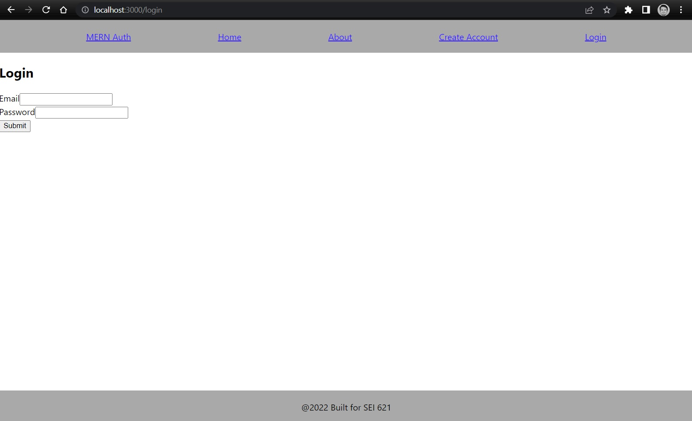
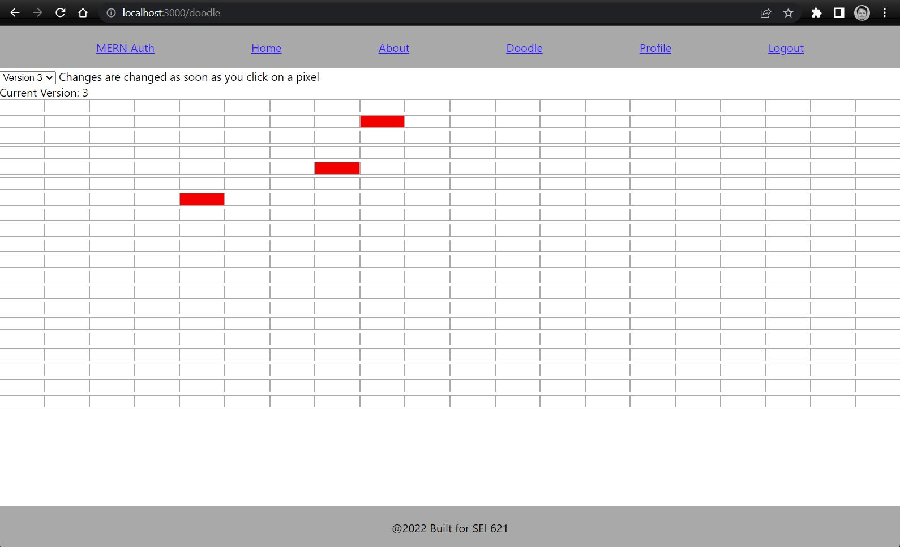

# Doodle history app

This is a simple web app that allows a user to log into the site with an email and password and then draw a piece 20x20 of pixel art. 

This app will save each new pixel added to the drawing and will allow the user to rewind their drawing, as in, visit the state of the drawing for each pixel placed. This drawing will be stored in mongoDB via our backend application with an association to our user that we used to log in with. 

The goals of the project are to challenge you to implement some more complex mongoDB models, as well as some more complex and algorithmically rigorous frontend data manipulation logic. We also hope to reinforce the fundamentals of MERN stack by building off the same template we used for project 3 and by providing you an excuse to get some additional MERN stack reps in. 

## Authentication

We'll be using the Authentication boiler plate form project 3, and will be using the user created to associate our drawing to. 

We will be using a JWT for our authentication(like in project 3) please review the postman collections in the backend project to see how we're storing our token in postman and how we're passing that token to our API.

Feel free to style this page in a way that you feel is challenging you and your CSS skills. 



## Draw page(baseURL/doodles)

The guts of our application will be inside of the doodle Page. You will click on each cell on the draw page to add a red pixel, this change will be passed to the backend and will be stored for your user in mongodb. You can also see on the top left corner of the page, there is a version dropdown(should be between 0-n), this will allow you to rewind your actions used to draw your pixel art. 



this image is of our 3rd pixel edit.

When we click on new cells we will create a new version, if we click on a red cell it will be updated to white, and when we click on a white cell it will be updated in a new version with a red cell. 

See how when we draw a smiley face, we will have added 9 additional versions for the individual pixel updates. 


# Setup

Please install npm packages with 

```
npm i
```

then ensure that you have the backend project running and your local mongodb instance running(or atlas connection added to backend).

You must also include a .env file that looks like this 

```
REACT_APP_SERVER_URL=http://localhost:5000
```

our backend project is configured to run on PORT 5000. 

# Steps

NOTE: before you start working on the frontend, go and complete the backend portions, they don't require as much effort and you'll want to understand how you built your backend before you build your frontend.

We will challenge you all to create this doodle app with the functionality to rewind our drawing using react on our frontend. I'll provide a bare bones solution to to this project inside of this repo under the solution branch. This solution will only have basic styling and some basic features. I'd encourage you all to use this branch only as a reference when you are stuck. I would also encourage you all to ensure that you apply clean and visually sensible styles for these pages, as well, feel free to challenge yourself and add some of these additional suggested features(or anything else you feel this app could have). 

in addition(again) feel free to use these boiler plate templates to build something entirely different. This boiler plate uses latest stable versions of all its dependencies, feel free to use this as an excuse to get creative and go your own way. 

### Suggested features

1. Try to add alternative colors to your pixels, allow users to select multiple colors for a drawing and save them to mongodb so when you revisit you can see your color changes.
2. Try to allow users to create multiple doodles. This would involve maybe making a doodle list page. 
3. Try to implement a version lifecycle animation, where when you load a doodle the react app which will show each version for a second or two and progress through the versions to the latest one, so you make almost a 15-30 second animation of what you did in each doodle, a doodle reply function.  

## Create the doodle pad components

This will be our doodle page, we will display the drawing pad and also fetch existing doodle versions and render them to the page using two visual components, pixelRow and pixel. 

### Create doodle cell component(pixelRow/pixel)

1. Create a doodle component, this shouldn't need to take any props, this will be the entry point of our doodle feature.

2. Create your state

    - Create a state for our doodle versions

    - Create a state for our current version

    - create a state for is loaded(might be able to go without this, but would be a nice touch to ensure you don't try to render your 20x20 drawing before you have any cell data to load)

    - Create a state for your latest version, you'll need to store what the latest version is for when you make updates, if someone makes an update on an older version, you'll want to make sure you don't add those changes to a version that has already been created(Your doodle versions should be immutable).

3. Create a useEffect to load up your doodle versions from the API

    - This should make a post call to your API to fetch your users doodle

    - Consider how you want to load up your doodle versions into your doodle component state, I'd recommend using some dictionary type data structures to make it easier to lookup versions and filter deltas.

    also, consider making a helper method for converting your array of doodle versions to dictionaries(maps) to more easily check if a version is being updated or added.

    ```javascript
    const createDoodleChangeMap = (doodleVersion) => {
        if (doodleVersion) {
            return doodleVersion.reduce((doodleDictionary, current) => {
                doodleDictionary[`${current.x}-${current.y}`] = true;
                return doodleDictionary;
            }, {});
        } else {
            // no doodle version, so we'll simply pass back an empty object
            return {}
        }
    }
    ```

4. Create a pixelRow component

    - This component is going to hold a row of pixels, this component should be simple array of DOM elements, and each row should contain pixel components, a component made to hold the x and y value of each cell and the color fo the cell.

    EX: example pixelRow component
    ```js
    const PixelRow = (props) => {
        const { pixels, handlePixelClick } = props;
        return pixels.map(pixel => {
            return <Pixel x={pixel.x} y={pixel.y} color={pixel.color} handlePixelClick={handlePixelClick}/>
        })
    }
    ```

    - Create a pixel component, this can be a simple component that accepts an event handler and displays a div with the color for each cell. 

    EX: Pixel component
    ```js
    const Pixel = (props) => {
        const {x, y, color, handlePixelClick} = props;
        return (
            <div x-attr={x} y-attr={y} className={`pixel ${color}`} onClick={handlePixelClick}/>
        )
    }
    ```

    - Create an event handler that will be passed down to each pixel component, this should be used to edit your current doodle version with pixel updates. This handler should make a post call to your API to update your doodle with a new doodle version, because each pixel change is going to be a new doodle version.

    EX: what a pixel update handler could look like
    ```javascript
        const handlePixelClick = (e) => {
            const changeMap = createDoodleChangeMap(doodleVersions[currentVersion])
            let newWorkingVersion = doodleVersions;
            const inputX = e.target.attributes['x-attr'].value;
            const inputY = e.target.attributes['y-attr'].value;
            if (changeMap[`${inputX}-${inputY}`]) {
                // remove item
                newWorkingVersion[currentVersion] = newWorkingVersion[currentVersion].filter(i => `${i.x}-${i.y}` !== `${inputX}-${inputY}`);
            } else {
                // add item
                if (!newWorkingVersion[currentVersion]) {
                    // we do not have an existing version, we'll need to add our initial version.
                    newWorkingVersion[currentVersion] = [];
                }
                // we have an existing version we'll be adding new pixels to
                newWorkingVersion[currentVersion].push({
                    // grabbing the x and y dom attributes added to each pixel that is clicked and adding those to our current version
                    x: inputX,
                    y: inputY
                });
            }
            setDoodleVersions(newWorkingVersion);
            setCurrentVersion(latestVersion);
            // pushing new change up to backend
            setAuthToken(localStorage.getItem('jwtToken'));
            axios({
                method: 'post',
                url: `${REACT_APP_SERVER_URL}/doodles/update`,
                data: {
                    version: latestVersion + 1,
                    doodleCoords: doodleVersions[latestVersion].map((coord) => {
                        return {
                            xCoord: coord.x,
                            yCoord: coord.y
                        }
                    })
                }
            }).then((response) => {
                updateDoodleHistory(response);
            })
            .catch((err) => {
                console.log(err)
            })
    }
    ```

### Create rewind dropdown component

Create another component, maybe call it 'DoodleControl', this will hold your doodle version dropdown that will use state objects from your doodle component to trigger rerenders, this will be used to switch between versions. 

1. Create doodleControl component

EX: maybe your control component will look like this

```javascript
const DoodleControls = (props) => {
    const { versions, setVersion, currentVersion, handleSubmit} = props;

    const handleSelectChange = (e) => {
        setVersion(e.target.value);
    }

    const renderOptions = () => {
        if (Object.keys(versions).length > 0) {
            return Object.keys(versions).map((versionKey) => <option value={versionKey}>Version {versionKey}</option>)
        } else {
            return <option>none</option>
        }
    }

    return (
        <div className="doodle-controls">
            <select onChange={handleSelectChange} value={currentVersion}>
                {renderOptions()}
            </select>
            <span> Changes are changed as soon as you click on a pixel</span>
        </div>
    )
}
```

notice how this example gets a setVersion passed down from the parent component, this allows us to easily rerender a given version from the child component.


# Final Notes

We're not going to provide much more guidance for frontend other than this rough guide and the solutions branch in github. The reason for this is I want this exercise to be more free form and to allow you all to challenge yourselves to finding a solution to a scenario you probably haven't been exposed to. This problem involves dealing with complex array mutations and finding efficient ways to search and sort these arrays so you ensure you display your discrete version changes in the proper way. I'd encourage you all to look through the solutions branch and try and understand how I chose to solve the version issue with dictionaries. 

Good luck, make this project your own and I hope you push yourself out of your comfort zone and you refine some of the skills we've been teaching in class. 